```mermaid
graph TD
		A[🗃️ Data Ingestion] --> B[🔍 Data Validation]
		B --> C[🛠️ Data Transformation]
		C --> D[🌲 Model Training]
		D --> E[📊 Model Evaluation]
		E --> F[🤖 Prediction Pipeline]
		F --> G[🌐 FastAPI Web App]
```

<div align="center">
	
	<h1 style="color:#0077ff;">🚗 VEHICLE INSURANCE PREDICTION SYSTEM 🚦</h1>
	<p><b>End-to-End ML Pipeline | FastAPI Web App | MongoDB | Beautiful UI</b></p>
	
	
	
	
	
</div>

---

<div align="center">


</div>

---

## 🌈 <span style="color:#ff69b4;">Project Overview</span>

Welcome to the <b>Vehicle Insurance Prediction System</b>!<br>
<span style="color:#0077ff;">A visually stunning, modular, and production-ready machine learning pipeline for predicting vehicle insurance outcomes.</span>

<div align="center">

</div>

---

## 🗂️ <span style="color:#ff9800;">Project Structure</span>

```bash
VEHICLE_INSURANCE/
│
├── app.py                  # 🚀 FastAPI web app
├── pipeline/
│   ├── training_pipeline.py
│   └── prediction_pipeline.py
├── components/
│   ├── data_ingestion.py
│   ├── data_validation.py
│   ├── data_transformation.py
│   ├── model_trainer.py
│   └── model_evaluation.py
├── configration/
│   └── mongo_db_connection.py
├── logger/
│   └── __init__.py
├── constants/
│   └── __init__.py
├── utils/
│   └── main_utils.py
├── schema.yaml             # 📜 Data schema
├── requirements.txt
├── README.md
└── artifacts/              # 🗃️ Timestamped pipeline outputs
```

---

## 🚦 <span style="color:#00bcd4;">End-to-End Flow</span>

<div align="center">

</div>



---

## 🧩 <span style="color:#4caf50;">Pipeline Modules</span>

### 1️⃣ Data Ingestion
> Loads raw data from MongoDB or CSV.<br>Splits into train/test sets.<br>Saves to timestamped artifact directories.

### 2️⃣ Data Validation
> Checks column names, types, and schema compliance.<br>Generates validation reports.

### 3️⃣ Data Transformation
> Applies custom feature engineering (gender mapping, dummy variables, column renaming, scaling).<br>Uses a schema-driven preprocessor.<br>Saves transformed arrays and reports.

### 4️⃣ Model Training
> Trains a RandomForest model (configurable).<br>Handles class imbalance with SMOTEENN.<br>Saves model and training report.

### 5️⃣ Model Evaluation
> Evaluates model on test data.<br>Saves evaluation metrics and report.

### 6️⃣ Prediction Pipeline
> Loads latest model and preprocessor.<br>Accepts JSON input, applies transformations, returns predictions.

---

## 🌐 <span style="color:#e91e63;">FastAPI Web App</span>

<div align="center">

</div>

- **Index Page**: Welcome and project info.<br>
- **About Us**: Team/project details.<br>
- **Train**: Initiates the full training pipeline.<br>
- **Predict**: Accepts JSON data, returns predictions.

### API Endpoints

| Method | Route      | Description                       |
|--------|------------|-----------------------------------|
| GET    | `/`        | Index page                        |
| GET    | `/about`   | About us page                     |
| GET    | `/train`   | Run training pipeline             |
| GET    | `/predict` | Prediction HTML page              |
| POST   | `/predict` | Predict from JSON data            |

---

## 📝 <span style="color:#9c27b0;">Example Prediction Request</span>

```json
{
	"Gender": "Male",
	"Age": 35,
	"Driving_License": 1,
	"Region_Code": 28,
	"Previously_Insured": 0,
	"Vehicle_Age": "> 2 Years",
	"Vehicle_Damage": "Yes",
	"Annual_Premium": 35000,
	"Policy_Sales_Channel": 26,
	"Vintage": 120
}
```

---

## 🛠️ <span style="color:#ff5722;">Installation & Usage</span>

### 1. Clone the repo
```bash
git clone https://github.com/adnan-qazii/VEHICLE_INSURANCE.git
cd VEHICLE_INSURANCE
```

### 2. Install dependencies
```bash
pip install -r requirements.txt
```

### 3. Run the FastAPI app
```bash
uvicorn app:app --reload
```
Visit [http://localhost:8000](http://localhost:8000) in your browser.

---

## 🏆 <span style="color:#00c853;">Features</span>

- Modular, timestamped artifact management
- Schema-driven validation and transformation
- Robust logging and error handling
- Interactive web interface (FastAPI + Jinja2)
- RESTful API for predictions
- MongoDB integration
- YAML-based configuration and reporting

---

## 🎨 <span style="color:#ffeb3b;">Aesthetics & Icons</span>

<div align="center">
🚗 Vehicle Insurance &nbsp; 🧠 Machine Learning &nbsp; 🗂️ Modular Pipeline &nbsp; 🌐 Web API &nbsp; 📊 Reports &nbsp; 🛡️ Validation &nbsp; 🏆 Production Ready
</div>

---

## 📈 <span style="color:#2196f3;">Flowchart</span>

<div align="center">

</div>

---

## 📚 <span style="color:#795548;">References</span>

- [FastAPI Documentation](https://fastapi.tiangolo.com/)
- [Scikit-learn Documentation](https://scikit-learn.org/)
- [MongoDB Documentation](https://www.mongodb.com/docs/)
- [Pandas Documentation](https://pandas.pydata.org/)

---

## 👨‍💻 <span style="color:#607d8b;">Author</span>

**Adnan Qazi**  
[GitHub](https://github.com/adnan-qazii)

---

## 🏁 <span style="color:#ff1744;">License</span>

This project is licensed under the MIT License.

---

<div align="center">
<b>Made with ❤️ for robust, beautiful, and production-ready ML solutions!</b>
</div>
